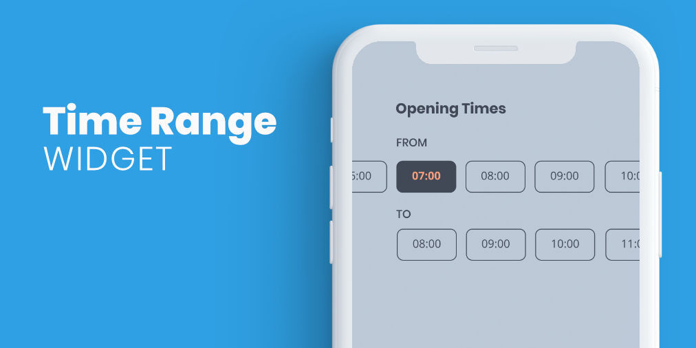

**DISCONTINUED - Flutter package for selecting a time range with time blocks.**

## Getting Started

You can use this package when you need to add a time range selector to your application. You can indicate the size of the steps of the initial time and the blocks of time that the range must contain. You can also customize the component styles.


## Properties

| Property              | Type                           | Description                                                                                                                                                                             |
|:----------------------|:-------------------------------|:----------------------------------------------------------------------------------------------------------------------------------------------------------------------------------------|
| fromTitle             | Widget                         | Widget displayed as the start time selector title                                                                                                                                       |
| toTitle               | Widget                         | Widget displayed as the end time selector title                                                                                                                                         |
| titlePadding          | double                         | Left padding applied to fromTitle and toTitle                                                                                                                                           |
| borderColor           | Color                          | Time selection button border color color                                                                                                                                                        |
| activeBorderColor     | Color                          | Time selection button border color selected color                                                                                                                                                        |
| textStyle             | TextStyle                      | Time selection button textstyle                                                                                                                                                        |
| activeTextStyle       | TextStyle                      | Time selection button selected textstyle                                                                                                                                               |
| backgroundColor       | Color                          | Time selection button background color                                                                                                                                                  |
| activeBackgroundColor | Color                          | Time selection button selected background color                                                                                                                                         |
| firstTime             | TimeOfDay                      | Picker start time                                                                                                                                                                       |
| lastTime              | TimeOfDay                      | Picker end time                                                                                                                                                                         |
| initialRange          | TimeRangeResult                | Initial range selected                                                                                                                                                                  |
| timeStep              | double                         | Minutes jumps between initial selector hours                                                                                                                                            |
| timeBlock             | double                         | Size in minutes of time blocks. The final selector will be recalculated depending on the selected start time for the user to select a range that contains a multiple of this time range |
| onRangeCompleted      | void Function(TimeRangeResult) | Callback that notifies a change in the selected range. If, with a selected range, an initial time is selected again, the callback will return null.                                     |

## Use example

You can review the example folder for a complete example of using the widget.

```
TimeRange(
    fromTitle: Text('From', style: TextStyle(fontSize: 18, color: gray),),
    toTitle: Text('To', style: TextStyle(fontSize: 18, color: gray),),
    titlePadding: 20,
    textStyle: TextStyle(fontWeight: FontWeight.normal, color: Colors.black87),
    activeTextStyle: TextStyle(fontWeight: FontWeight.bold, color: Colors.white),
    borderColor: dark,
    backgroundColor: Colors.transparent,
    activeBackgroundColor: orange,
    firstTime: TimeOfDay(hour: 14, minute: 30),
    lastTime: TimeOfDay(hour: 20, minute: 00),
    timeStep: 10,
    timeBlock: 30,
    onRangeCompleted: (range) => setState(() => print(range)),
  )
  ```
